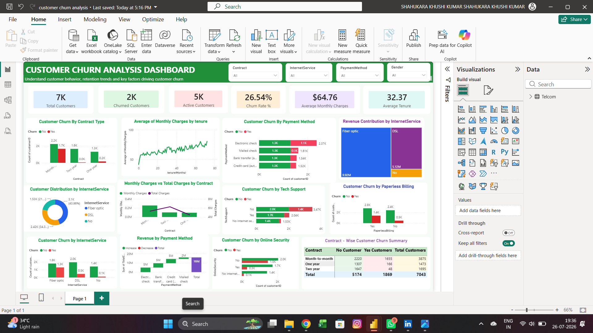

# 📊 Customer Churn Analysis Dashboard using Power BI

---

# 📖 1. Project Overview

Customer churn is one of the biggest challenges faced by telecommunication companies. Retaining existing customers is more cost-effective than acquiring new ones. This project presents an interactive **Customer Churn Analysis Dashboard** built using **Microsoft Power BI** to analyze customer behavior, identify the major factors contributing to customer churn, and support data-driven business decisions.

The dashboard provides interactive KPI cards, slicers, and visualizations that help stakeholders monitor churn trends, understand customer behavior, and identify high-risk customer segments.

---

# 🎯 2. Objective

The primary objectives of this project are:

-  Analyze customer churn patterns.
-  Monitor customer retention performance.
-  Identify factors influencing customer churn.
-  Compare churn across different customer segments.
-  Generate actionable business insights.
-  Support strategic business decision-making.

---

# 🗂️ 3. Dataset Information

### 📁 Dataset Name

**IBM Telco Customer Churn Dataset**

### 📈 Dataset Summary

- **Total Customers:** 7,043
- **Total Columns:** 21

| Column Name | Data Type | Description |
|------------|-----------|-------------|
| customerID | Text | Unique customer identifier |
| gender | Text | Customer gender (Male/Female) |
| SeniorCitizen | Whole Number | Indicates whether the customer is a senior citizen |
| Partner | Text | Whether the customer has a partner |
| Dependents | Text | Whether the customer has dependents |
| tenure | Whole Number | Number of months the customer has stayed with the company |
| PhoneService | Text | Phone service subscription |
| MultipleLines | Text | Multiple phone lines subscription |
| InternetService | Text | DSL, Fiber Optic or No Internet Service |
| OnlineSecurity | Text | Online security subscription |
| OnlineBackup | Text | Online backup subscription |
| DeviceProtection | Text | Device protection service |
| TechSupport | Text | Technical support subscription |
| StreamingTV | Text | TV streaming subscription |
| StreamingMovies | Text | Movie streaming subscription |
| Contract | Text | Customer contract type |
| PaperlessBilling | Text | Paperless billing status |
| PaymentMethod | Text | Customer payment method |
| MonthlyCharges | Decimal Number | Monthly subscription charges |
| TotalCharges | Decimal Number | Total charges paid |
| Churn | Text | Customer churn status (Yes/No) |

---

# 🚀 4. Dashboard Features

## 📌 KPI Cards

-  Total Customers
-  Churned Customers
-  Active Customers
-  Churn Rate (%)
-  Average Monthly Charges
-  Average Customer Tenure

## 🎛️ Interactive Filters

-  Contract
-  Internet Service
-  Payment Method
-  Gender

## 📊 Dashboard Visualizations

-  Customer Churn by Contract Type
-  Average Monthly Charges by Tenure
-  Customer Churn by Payment Method
-  Revenue Contribution by Internet Service (Treemap)
-  Customer Distribution by Internet Service (Donut Chart)
-  Monthly Charges vs Total Charges by Contract (Combo Chart)
-  Customer Churn by Tech Support
-  Customer Churn by Paperless Billing
-  Customer Churn by Internet Service
-  Revenue by Payment Method (Waterfall Chart)
-  Customer Churn by Online Security
-  Contract-wise Customer Churn Summary (Matrix)

---
# 🖼️ 5. Dashboard Preview

---

# 💡 6. Business Insights

-  Customers with **Month-to-month contracts** experience the highest churn.
-  Long-term contracts (One Year and Two Year) have better customer retention.
-  **Fiber Optic** customers contribute significantly to overall revenue.
-  Customers subscribed to **Tech Support** show lower churn.
-  Customers using **Online Security** tend to stay longer.
-  Customers paying through **Electronic Check** have comparatively higher churn.
-  Interactive filters enable quick analysis of specific customer segments.

---

# 📈 7. Business Recommendations

-  Encourage customers to move to long-term contracts.
-  Offer loyalty rewards to high-risk customer groups.
-  Improve Fiber Optic customer experience.
-  Promote Tech Support and Online Security services.
-  Review Electronic Check payment experience.
-  Use customer segmentation for personalized retention campaigns.
-  Continuously monitor churn using interactive dashboards.

---

# 🏢 8. Business Requirements

The dashboard helps businesses to:

-  Monitor customer churn.
-  Track customer retention.
-  Identify high-risk customer groups.
-  Compare churn across customer segments.
-  Analyze revenue contribution.
-  Support business decision-making.
-  Improve customer satisfaction.

---

# 🛠️ 9. Tools & Technologies

| Tool | Purpose |
|------|---------|
|  Microsoft Power BI | Dashboard Development |
|  Power Query | Data Cleaning & Transformation |
|  DAX | KPI Calculations & Measures |
|  CSV Dataset | Data Source |
|  IBM Telco Customer Churn Dataset | Business Dataset |

---

# ✅ 10. Conclusion

This **Customer Churn Analysis Dashboard** provides a comprehensive overview of customer behavior, churn trends, and revenue contribution. By combining interactive KPI cards, filters, and business-focused visualizations, the dashboard enables decision-makers to identify customer segments with high churn, evaluate business performance, and implement effective customer retention strategies.

The project demonstrates practical skills in **Power BI, DAX, Power Query, data visualization, dashboard design, and business analytics**, making it suitable for business reporting and executive decision-making.

---

# 👨‍💻  Author

**Khushikumar Shahukara**

🎓 MBA – Business Analytics & Marketing
Aspiring Business Analyst| Marketing Analyst

---

## ⭐ If you found this project helpful, don't forget to **Star ⭐ the repository!**
